# Схема базы данных Orthodox Back

## ER-диаграмма

```mermaid
erDiagram
    TOUR_OPERATORS {
        int id PK
        string name
        string type
        string diocese
        string country
        string region
        string city
        string settlement
        string email
        string phone
        text description
        string avatar
        json json_attributes
        boolean is_active
        timestamp created_at
        timestamp updated_at
        timestamp deleted_at
    }

    USERS {
        int id PK
        string name
        string email
        string full_name
        string phone
        string password
        timestamp email_verified_at
        boolean is_active
        json json_attributes
        int tour_operator_id FK
        timestamp created_at
        timestamp updated_at
        timestamp deleted_at
    }

    ENTITIES {
        int id PK
        string title
        string type
        string avatar
        string email
        string phone
        text description
        json json_attributes
        boolean is_active
        int entity_type_id
        int seats
        date agreement_valid_from
        date agreement_valid_to
        int tour_operator_id FK
        timestamp created_at
        timestamp updated_at
        timestamp deleted_at
    }

    TOURS {
        int id PK
        string title
        string route
        text description
        int duration
        decimal price
        int seats
        date date_start
        date date_end
        date date
        time time
        int day_count
        int night_count
        string country
        string city
        string difficulty
        string comfort
        json options
        json json_attributes
        boolean is_active
        boolean is_template
        int template_id FK
        int tour_operator_id FK
        timestamp created_at
        timestamp updated_at
    }

    TOUR_DATES {
        int id PK
        int tour_id FK
        date date
        time time
        datetime datetime
        int seats
        string title
        text description
        json json_attributes
    }

    TOUR_DAYS {
        int id PK
        int tour_id FK
        string title
        text description
        date date
        int order_column
        json json_attributes
    }

    TOUR_POINTS {
        int id PK
        int tour_id FK
        int entity_id FK
        string title
        text description
        string address
        time time
        date date
        decimal latitude
        decimal longitude
        json json_attributes
        int order_column
    }

    TOUR_ENTITIES {
        int id PK
        int tour_id FK
        int entity_id FK
        json json_attributes
        int order_column
    }

    TOUR_SERVICES {
        int id PK
        int tour_id FK
        int entity_id FK
        string title
        text description
        string type
        decimal price
        json json_attributes
        int order_column
        boolean is_active
    }

    CUSTOMERS {
        int id PK
        string firstname
        string lastname
        string patronymic
        string email
        string phone
        text description
        string gender
        string passport_series
        string passport_number
        date passport_issue_date
        string passport_unit_name
        string passport_unit_code
        date passport_birth_date
        string passport_birth_place
        text passport_address
        string snils
        json json_attributes
        int tour_operator_id FK
        timestamp created_at
        timestamp updated_at
        timestamp deleted_at
    }

    BOOKINGS {
        int id PK
        int tour_id FK
        string status
        string payment_status
        text description
        json json_attributes
        int tour_operator_id FK
        timestamp created_at
        timestamp updated_at
    }

    BOOKING_CUSTOMER {
        int booking_id FK
        int customer_id FK
        timestamp created_at
        timestamp updated_at
    }

    TOUR_OPERATOR_MANAGERS {
        int tour_operator_id FK
        int user_id FK
        timestamp created_at
        timestamp updated_at
    }

    BANK_ACCOUNTS {
        int id PK
        int bankable_id
        string bankable_type
        string account_number
        string bank_name
        string bik
        string correspondent_account
    }

    LEGAL_REQUISITES {
        int id PK
        int requisiteable_id
        string requisiteable_type
        string inn
        string kpp
        string ogrn
        string legal_address
        string actual_address
    }

    GEO_LOCATIONS {
        int id PK
        int geoable_id
        string geoable_type
        decimal latitude
        decimal longitude
        string address
    }

    GEO_AREAS {
        int id PK
        int geoable_id
        string geoable_type
        json polygon_data
    }

    IMAGES {
        int id PK
        int imageable_id
        string imageable_type
        string path
        string alt
        int order_column
    }

    UPLOADS {
        int id PK
        int uploadable_id
        string uploadable_type
        string path
        string original_name
        string mime_type
        int size
    }

    NOTES {
        int id PK
        int notable_id
        string notable_type
        text content
        timestamp created_at
        timestamp updated_at
    }

    TAXONOMIES {
        int id PK
        string name
        string type
        text description
    }

    TAXONOMY_ENTITY {
        int taxonomy_id FK
        int entity_id FK
    }

    TAXONOMY_TOUR {
        int taxonomy_id FK
        int tour_id FK
    }

    %% Основные связи
    TOUR_OPERATORS ||--o{ USERS : "manages"
    TOUR_OPERATORS ||--o{ ENTITIES : "owns"
    TOUR_OPERATORS ||--o{ TOURS : "creates"
    TOUR_OPERATORS ||--o{ CUSTOMERS : "serves"
    TOUR_OPERATORS ||--o{ BOOKINGS : "handles"

    USERS ||--o{ TOUR_OPERATOR_MANAGERS : "manages"
    TOUR_OPERATORS ||--o{ TOUR_OPERATOR_MANAGERS : "managed_by"

    TOURS ||--o{ TOUR_DATES : "has_dates"
    TOURS ||--o{ TOUR_DAYS : "has_days"
    TOURS ||--o{ TOUR_POINTS : "has_points"
    TOURS ||--o{ TOUR_ENTITIES : "includes_entities"
    TOURS ||--o{ TOUR_SERVICES : "provides_services"
    TOURS ||--o{ BOOKINGS : "booked_for"
    TOURS ||--o{ TOURS : "template_of"

    ENTITIES ||--o{ TOUR_POINTS : "located_at"
    ENTITIES ||--o{ TOUR_ENTITIES : "included_in"
    ENTITIES ||--o{ TOUR_SERVICES : "provides"

    BOOKINGS ||--o{ BOOKING_CUSTOMER : "has_customers"
    CUSTOMERS ||--o{ BOOKING_CUSTOMER : "books"

    %% Полиморфные связи
    TOUR_OPERATORS ||--o{ BANK_ACCOUNTS : "has_accounts"
    ENTITIES ||--o{ BANK_ACCOUNTS : "has_accounts"
    
    TOUR_OPERATORS ||--o{ LEGAL_REQUISITES : "has_requisites"
    ENTITIES ||--o{ LEGAL_REQUISITES : "has_requisites"
    
    TOUR_OPERATORS ||--o{ GEO_LOCATIONS : "located_at"
    ENTITIES ||--o{ GEO_LOCATIONS : "located_at"
    TOUR_POINTS ||--o{ GEO_LOCATIONS : "located_at"
    
    TOUR_OPERATORS ||--o{ GEO_AREAS : "covers_area"
    ENTITIES ||--o{ GEO_AREAS : "covers_area"
    
    TOUR_OPERATORS ||--o{ IMAGES : "has_images"
    ENTITIES ||--o{ IMAGES : "has_images"
    TOURS ||--o{ IMAGES : "has_images"
    TOUR_DAYS ||--o{ IMAGES : "has_images"
    
    TOUR_OPERATORS ||--o{ UPLOADS : "has_uploads"
    ENTITIES ||--o{ UPLOADS : "has_uploads"
    TOURS ||--o{ UPLOADS : "has_uploads"
    
    TOURS ||--o{ NOTES : "has_notes"
    
    ENTITIES ||--o{ TAXONOMY_ENTITY : "categorized_by"
    TAXONOMIES ||--o{ TAXONOMY_ENTITY : "categorizes"
    
    TOURS ||--o{ TAXONOMY_TOUR : "categorized_by"
    TAXONOMIES ||--o{ TAXONOMY_TOUR : "categorizes"
```

## Описание основных сущностей

### TourOperator (Туроператор)
Центральная сущность системы, представляющая туристическую компанию. Содержит информацию о компании, её местоположении, контактах и настройках.

### User (Пользователь)
Пользователи системы - менеджеры туроператоров. Связаны с туроператорами через промежуточную таблицу.

### Entity (Сущность)
Различные объекты туристической инфраструктуры: отели, рестораны, достопримечательности, транспорт и т.д.

### Tour (Тур)
Основная сущность для туристических программ. Поддерживает наследование через template_id для создания шаблонов туров.

### TourDate, TourDay, TourPoint, TourService
Детализированные компоненты тура:
- **TourDate**: конкретные даты проведения тура
- **TourDay**: описание дней тура
- **TourPoint**: точки маршрута
- **TourService**: услуги, включенные в тур

### Customer (Клиент)
Информация о клиентах с паспортными данными и контактной информацией.

### Booking (Бронирование)
Бронирования туров клиентами. Связывает туры с клиентами через промежуточную таблицу.

### Вспомогательные таблицы
- **BankAccounts, LegalRequisites**: финансовые и юридические данные
- **GeoLocations, GeoAreas**: географическая информация
- **Images, Uploads**: медиафайлы
- **Notes**: заметки
- **Taxonomies**: справочники для категоризации

## Особенности архитектуры

1. **Полиморфные связи**: используются для привязки общих сущностей (изображения, загрузки, геолокации) к различным моделям
2. **Наследование туров**: система шаблонов позволяет создавать типовые туры и их экземпляры
3. **Мультитенантность**: все основные сущности привязаны к туроператорам через scopes
4. **Мягкое удаление**: основные сущности используют SoftDeletes
5. **JSON атрибуты**: гибкое хранение дополнительных данных
6. **UUID**: использование UUID для внешних идентификаторов
